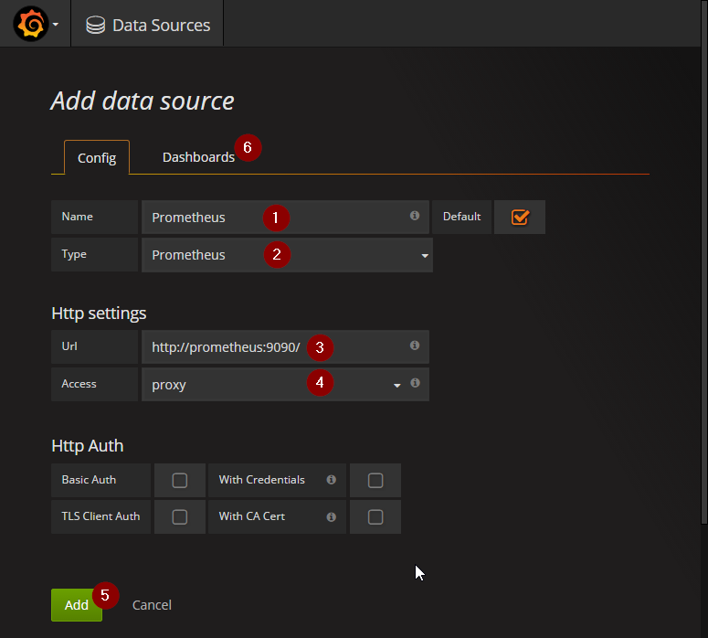

<# Prometheus Sample Infrastructure

## What to expect

Easy to setup Prometheus sample infrastructure

## Prerequisite

* Git
* Docker
* Docker-Compose

## How to Run

    git clone https://github.com/bjkastel/prometheus-sample-infra.git
    git submodule init
    git submodule update
    docker-compose up -d

## Services in the Sample

|===
| Service | Internal URL | External URL

| https://prometheus.io/[Prometheus]
| http://prometheus:9090
| http://localhost:9090

| https://grafana.com/[Grafana]
| http://grafana:3000
| http://localhost:3000

| https://github.com/ahus1/prometheusspringbootminimal/[Prometheus SpringBoot Minimal Sample]
| http://prometheusspringbootminimal:8080
| http://localhost:8080

| https://github.com/ahus1/prometheusvertxminimal/[Prometheus Vertx Minimal Sample]
| http://prometheusvertxminimal:8081
| http://localhost:8081

| https://github.com/prometheus/node_exporter[Node Exporter]
| http://node_exporter:8082
| http://localhost:8082

| https://github.com/google/cadvisor[cAdvisor]
| http://cadvisor:8083
| http://localhost:8083
|===

## Scrape Configuration

The internal URL is used by prometheus to scrape the targets:

[source, yaml, indent=0]
----
scrape_configs:
  # The job name is added as a label `job=<job_name>` to any timeseries scraped from this config.
  - job_name: 'prometheus'

    # metrics_path defaults to '/metrics'
    # scheme defaults to 'http'.

    static_configs:
      - targets:
        - 'localhost:9090'

  - job_name: 'infrastructure'
    static_configs:
      - targets:
        - 'node-exporter:9100'
        - 'cadvisor:8080'

  - job_name: 'prometheusspringbootminimal'
    static_configs:
      - targets:
        - 'prometheusspringbootminimal:8080'
    metrics_path: /prometheus

  - job_name: 'prometheusvertxminimal'
    static_configs:
      - targets:
        - 'prometheusvertxminimal:8081'
    metrics_path: /manage/metrics
----

## Configure Grafana

Open Grafana (http://localhost:3000).
Login with User `admin` and Password `admin`

Add a name (1), choose Prometheus as Type (2) and set the URL to `http://prometheus:9090/` (3).
You have to choose `proxy` as Access (4). After you have added the Datasource (5) you can import a preconfigured Prometheus Dashboard (6).
